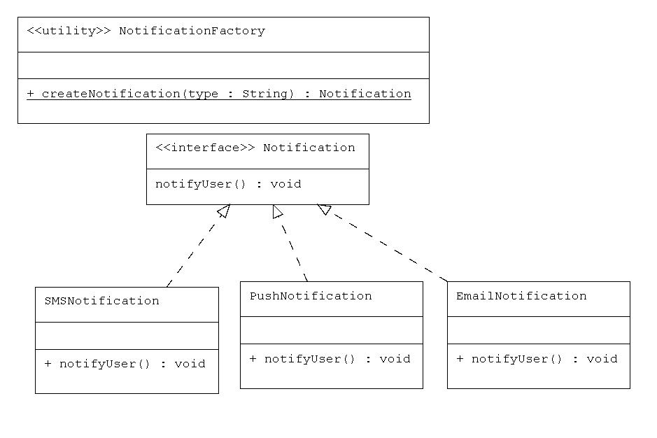
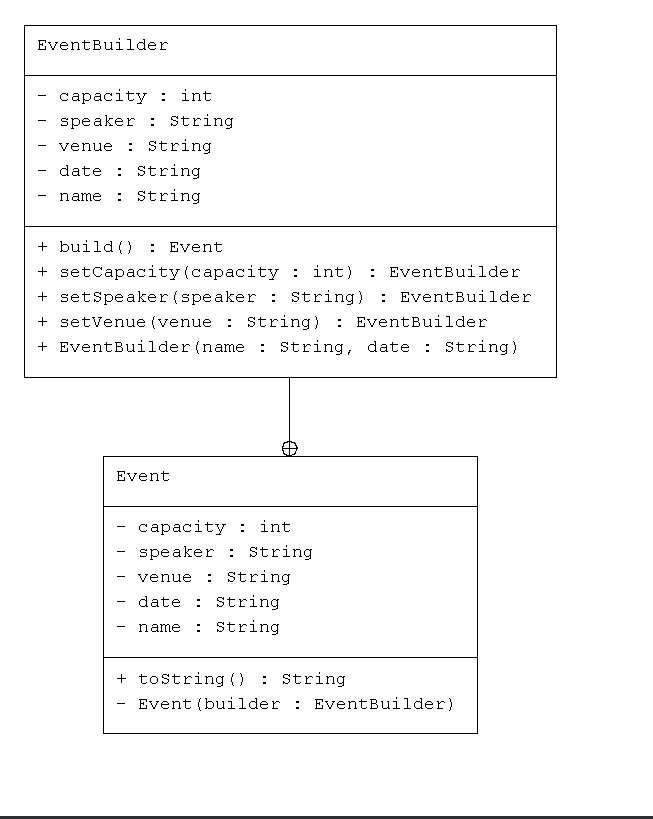
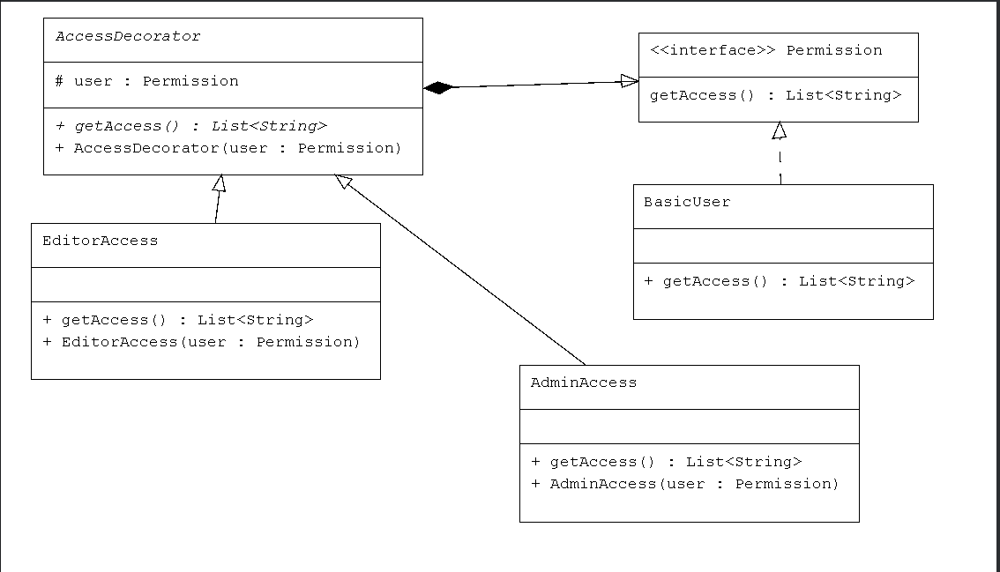
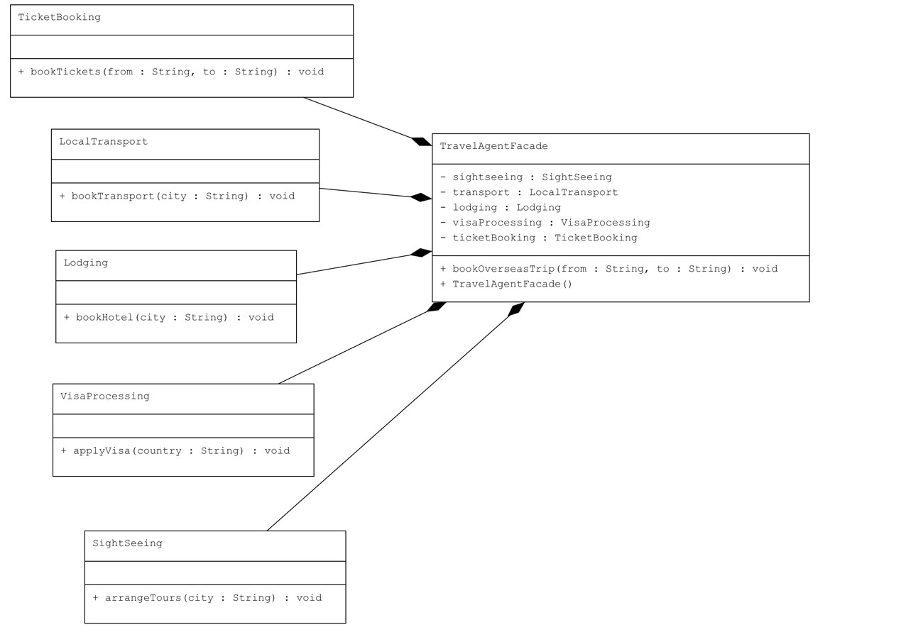

# Design Patterns Implementation

This repository contains implementations of various design patterns in Java, organized by category (Behavioral, Creational, Structural). Each pattern includes source code and UML diagrams for better understanding.

## Behavioral Patterns

### Command Pattern
The Command pattern encapsulates a request as an object, allowing parameterization of clients with queues, requests, and operations. It decouples the sender from the receiver.

**Use Case:** Media player controls (play, pause, rewind) where commands can be queued or undone.

### Null Command Pattern (Additional Learning)
The Null Command pattern provides a default do-nothing behavior for commands, avoiding null checks and providing a safe fallback.

**Use Case:** Handling button clicks in a UI where some buttons may not have actions assigned, preventing null pointer exceptions.

### Observer Pattern
The Observer pattern defines a one-to-many dependency between objects, so when one object changes state, all its dependents are notified.

**Use Case:** ICU patient monitoring system where multiple observers (doctors, nurses, family) are notified of patient status changes.

## Creational Patterns

### Factory Pattern
The Factory pattern provides an interface for creating objects in a superclass, allowing subclasses to alter the type of objects created.

**Use Case:** Notification system that creates different types of notifications (email, SMS, push) based on user preference.

### Builder Pattern
The Builder pattern separates the construction of a complex object from its representation, allowing the same construction process to create different representations.

**Use Case:** Building event objects with optional fields like title, date, location, and description.

## Structural Patterns

### Decorator Pattern
The Decorator pattern allows behavior to be added to an individual object dynamically, without affecting the behavior of other objects from the same class.

**Use Case:** User access control system where permissions (admin, editor) are layered on a basic user account.

### Facade Pattern
The Facade pattern provides a simplified interface to a complex subsystem, making it easier to use.

**Use Case:** Travel booking system that hides the complexity of booking flights, hotels, and visas behind a single interface.

