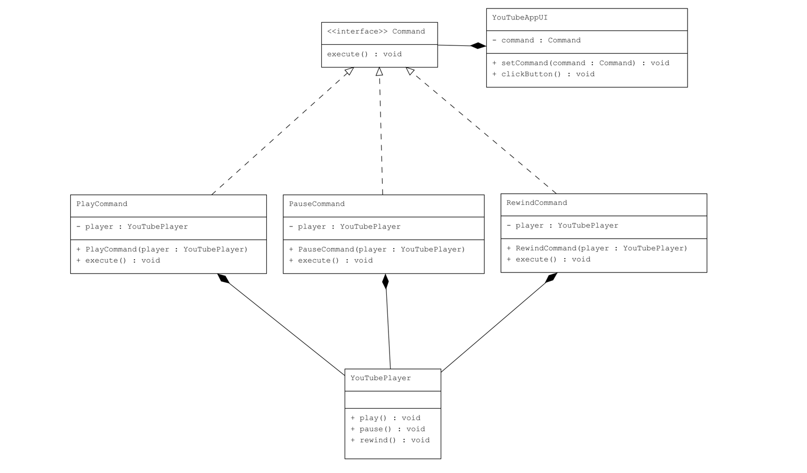

# YouTube Player – Command Design Pattern  

## Use Case  
We simulate a **YouTube Player** with a simple UI that can perform actions like:  
- Play a video  
- Pause a video  
- Rewind a video  

##  How it aligns with the Pattern  

- **Invoker** → `YouTubeAppUI` (UI buttons clicked by the user)  
- **Command Interface** → `Command` (defines `execute()`)  
- **Concrete Commands** → `PlayCommand`, `PauseCommand`, `RewindCommand`  
- **Receiver** → `YouTubePlayer` (executes actual video operations)  
- **Client** → `Main` (binds commands to buttons and simulates interaction)  

##  Real-Life Scenario  

When using YouTube:  
- Clicking **Play** starts the video.  
- Clicking **Pause** stops playback.  
- Clicking **Rewind** lets you revisit an earlier scene.  

The UI buttons don’t handle video logic directly — they delegate actions to the player through commands.  

## Benefits  
- Decouples UI controls from video logic  
- Makes it easy to extend functionality (e.g., Add FastForward, Mute)  
- Promotes reusability and flexibility  

## UML Diagram  
  
