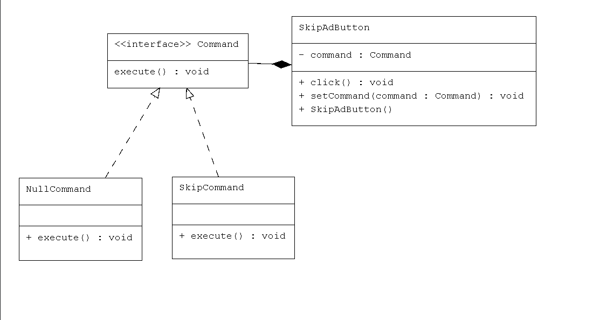

#  YouTube SkipAd – Command & NullCommand Pattern  

## Use Case  
Simulating a **YouTube "Skip Ad" button**:  
- Appears immediately when an ad starts  
- Remains **inactive for 5 seconds** (user cannot skip yet)  
- After 5 seconds, becomes usable and skips the ad  

This prevents premature clicks while keeping the UI consistent.  

## How It Works with the Pattern  

- **Invoker** → `SkipAdButton` (UI button clicked by the user)  
- **Command Interface** → `Command` (defines `execute()`)  
- **Concrete Commands**:  
  - `NullCommand` → does nothing during inactive state  
  - `SkipCommand` → skips the ad after waiting period  
- **Client** → `YouTubeAdDemo` (simulates ad play, wait, and enabling skip)  

## Real-Life Scenario  

When a YouTube ad starts, the **Skip Ad button appears but is inactive**.  
- For the first **5 seconds**, it is bound to a **NullCommand** → clicking has no effect.  
- After **5 seconds**, it is reassigned to **SkipCommand** → now the user can skip the ad safely.  

## UML Diagram  
  
