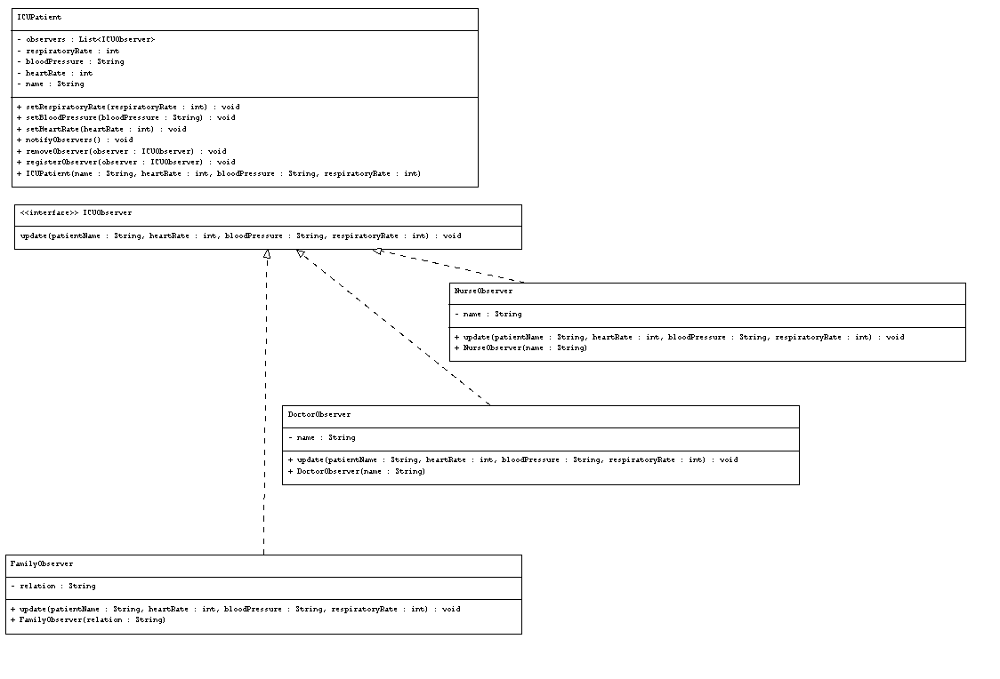

#  ICU Patient Monitoring System – Observer Pattern  

##  Use Case  
We simulate an **ICU patient monitoring system** where a patient’s vital signs are continuously tracked.  
Observers such as **doctors, nurses, and family members** are automatically notified when the patient’s condition changes.  

## How the Use Case Aligns with the Pattern  

- **Subject** → `ICUPatient` (maintains vital signs and observer list)  
- **Observer Interface** → `ICUObserver` (defines `update()`)  
- **Concrete Observers**:  
  - `DoctorObserver` → notified for clinical decisions  
  - `NurseObserver` → notified to provide immediate care  
  - `FamilyObserver` → notified to keep relatives informed  
- **Client** → `Main` (registers observers and simulates changes in vital signs)  

##  Real-Time ICU Monitoring Scenario  

Imagine **John Doe** is admitted to the ICU. His condition is constantly monitored:  

1. **Initial State** → Doctors, nurses, and family receive baseline vital signs  
2. **Heart Rate Drops** → Immediate notifications sent to all observers  
3. **Blood Pressure Spike** → Alerts go out automatically to take quick action  
4. **Respiratory Rate Change** → Observers are informed without delay  

This ensures **timely communication**, enabling fast clinical interventions and reassurance for the family.  

##  UML Diagram  
  
