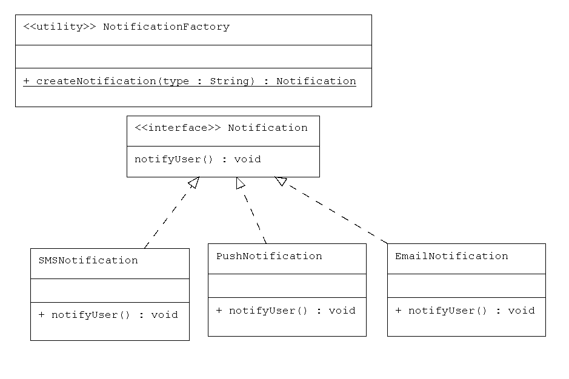

# Notification Factory – Factory Design Pattern  

## Use Case  
We simulate a Notification System that can send different types of notifications:  
- Email  
- SMS  
- Push Notification  

The client only requests the type of notification from the factory. It doesn’t need to know which exact class is being used.  

## How It Works with the Pattern  

- **Product Interface** → `Notification`  
- **Concrete Products** → `EmailNotification`, `SMSNotification`, `PushNotification`  
- **Factory** → `NotificationFactory`  
- **Client** → `Main`  

## Real-Life Scenario  

Imagine a banking app or an e-commerce platform:  
1. A user makes a transaction or places an order.  
2. The system needs to notify the user.  
3. Some users prefer Email, some prefer SMS, and others want Push Notifications.  
4. With the Factory Pattern, the system dynamically creates the right notification type without modifying client code.  

## Benefits  
- Decouples object creation from usage → improves flexibility.  
- Easily extensible → add new notification types without changing client code.  
- Simplifies code → the client doesn’t need to know the concrete classes.  

## UML Diagram  
  
 

