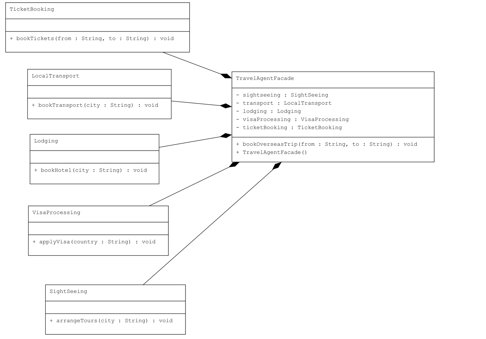

#  Travel Agent – Facade Design Pattern  

##  Use Case  
We simulate an Overseas Travel Booking System.  
The user (client) only calls the **TravelAgentFacade** to book a complete trip.  

The facade internally handles:  
- Visa processing  
- Flight tickets  
- Hotel booking  
- Local transport  
- Sightseeing tours  

##  How It Works with the Pattern  

- **Subsystem Classes** → `VisaProcessing`, `TicketBooking`, `Lodging`, `LocalTransport`, `SightSeeing`  
- **Facade** → `TravelAgentFacade` – provides a simple unified method `bookOverseasTrip()`  
- **Client** → `Main` – uses the facade instead of dealing with subsystems directly  

##  Real-Life Scenario  

Imagine you want to travel abroad:  
1. Without a travel agent, you must apply for a visa, book tickets, arrange hotels, transport, and sightseeing separately.  
2. With a travel agent (Facade), you simply say *“Book me a trip to Paris”*.  
3. The agent coordinates all subsystems behind the scenes, making it seamless for you.  

##  Benefits  
- Simplifies complex subsystem interactions  
- Provides a single point of access to multiple services  
- Reduces client dependency on subsystem details  
- Increases maintainability and flexibility  

## UML Diagram  
  

